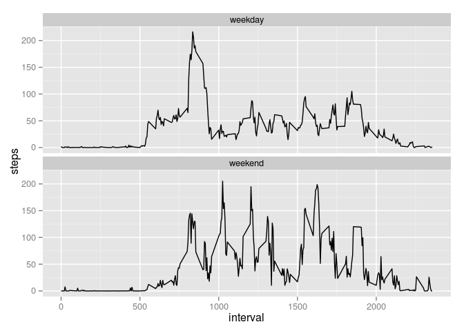

# Reproducible Research: Peer Assessment 1

## Loading and preprocessing the data

  Read the data and convert the date column to a date type and the inverval column
to a factor type.


```r
activity <- read.csv("activity.csv", nrows = 17568)
activity$date <- as.POSIXct(activity$date)
activity$interval <- as.factor(activity$interval)
```

## What is mean total number of steps taken per day?

Calculate the total steps by day using tapply function. Then generate an histogram of the result.


```r
total_steps <- tapply(activity$steps,activity$date, sum, na.rm = TRUE)
hist(total_steps)
```

 

Calculate the mean and the median steps by day and print the results.

```r
mean_steps <- tapply(activity$steps,activity$date, mean, na.rm = TRUE)
median_steps <- tapply(activity$steps,activity$date, median, na.rm = TRUE)

mean_steps
```

```
## 2012-10-01 00:00:00 2012-10-02 00:00:00 2012-10-03 00:00:00 
##                 NaN           0.4375000          39.4166667 
## 2012-10-04 00:00:00 2012-10-05 00:00:00 2012-10-06 00:00:00 
##          42.0694444          46.1597222          53.5416667 
## 2012-10-07 00:00:00 2012-10-08 00:00:00 2012-10-09 00:00:00 
##          38.2465278                 NaN          44.4826389 
## 2012-10-10 00:00:00 2012-10-11 00:00:00 2012-10-12 00:00:00 
##          34.3750000          35.7777778          60.3541667 
## 2012-10-13 00:00:00 2012-10-14 00:00:00 2012-10-15 00:00:00 
##          43.1458333          52.4236111          35.2048611 
## 2012-10-16 00:00:00 2012-10-17 00:00:00 2012-10-18 00:00:00 
##          52.3750000          46.7083333          34.9166667 
## 2012-10-19 00:00:00 2012-10-20 00:00:00 2012-10-20 23:00:00 
##          41.0729167          36.0937500          30.6284722 
## 2012-10-22 00:00:00 2012-10-23 00:00:00 2012-10-24 00:00:00 
##          46.7361111          30.9652778          29.0104167 
## 2012-10-25 00:00:00 2012-10-26 00:00:00 2012-10-27 00:00:00 
##           8.6527778          23.5347222          35.1354167 
## 2012-10-28 00:00:00 2012-10-29 00:00:00 2012-10-30 00:00:00 
##          39.7847222          17.4236111          34.0937500 
## 2012-10-31 00:00:00 2012-11-01 00:00:00 2012-11-02 00:00:00 
##          53.5208333                 NaN          36.8055556 
## 2012-11-03 00:00:00 2012-11-04 00:00:00 2012-11-05 00:00:00 
##          36.7048611                 NaN          36.2465278 
## 2012-11-06 00:00:00 2012-11-07 00:00:00 2012-11-08 00:00:00 
##          28.9375000          44.7326389          11.1770833 
## 2012-11-09 00:00:00 2012-11-10 00:00:00 2012-11-11 00:00:00 
##                 NaN                 NaN          43.7777778 
## 2012-11-12 00:00:00 2012-11-13 00:00:00 2012-11-14 00:00:00 
##          37.3784722          25.4722222                 NaN 
## 2012-11-15 00:00:00 2012-11-16 00:00:00 2012-11-17 00:00:00 
##           0.1423611          18.8923611          49.7881944 
## 2012-11-18 00:00:00 2012-11-19 00:00:00 2012-11-20 00:00:00 
##          52.4652778          30.6979167          15.5277778 
## 2012-11-21 00:00:00 2012-11-22 00:00:00 2012-11-23 00:00:00 
##          44.3993056          70.9270833          73.5902778 
## 2012-11-24 00:00:00 2012-11-25 00:00:00 2012-11-26 00:00:00 
##          50.2708333          41.0902778          38.7569444 
## 2012-11-27 00:00:00 2012-11-28 00:00:00 2012-11-29 00:00:00 
##          47.3819444          35.3576389          24.4687500 
## 2012-11-30 00:00:00 
##                 NaN
```

```r
median_steps
```

```
## 2012-10-01 00:00:00 2012-10-02 00:00:00 2012-10-03 00:00:00 
##                  NA                   0                   0 
## 2012-10-04 00:00:00 2012-10-05 00:00:00 2012-10-06 00:00:00 
##                   0                   0                   0 
## 2012-10-07 00:00:00 2012-10-08 00:00:00 2012-10-09 00:00:00 
##                   0                  NA                   0 
## 2012-10-10 00:00:00 2012-10-11 00:00:00 2012-10-12 00:00:00 
##                   0                   0                   0 
## 2012-10-13 00:00:00 2012-10-14 00:00:00 2012-10-15 00:00:00 
##                   0                   0                   0 
## 2012-10-16 00:00:00 2012-10-17 00:00:00 2012-10-18 00:00:00 
##                   0                   0                   0 
## 2012-10-19 00:00:00 2012-10-20 00:00:00 2012-10-20 23:00:00 
##                   0                   0                   0 
## 2012-10-22 00:00:00 2012-10-23 00:00:00 2012-10-24 00:00:00 
##                   0                   0                   0 
## 2012-10-25 00:00:00 2012-10-26 00:00:00 2012-10-27 00:00:00 
##                   0                   0                   0 
## 2012-10-28 00:00:00 2012-10-29 00:00:00 2012-10-30 00:00:00 
##                   0                   0                   0 
## 2012-10-31 00:00:00 2012-11-01 00:00:00 2012-11-02 00:00:00 
##                   0                  NA                   0 
## 2012-11-03 00:00:00 2012-11-04 00:00:00 2012-11-05 00:00:00 
##                   0                  NA                   0 
## 2012-11-06 00:00:00 2012-11-07 00:00:00 2012-11-08 00:00:00 
##                   0                   0                   0 
## 2012-11-09 00:00:00 2012-11-10 00:00:00 2012-11-11 00:00:00 
##                  NA                  NA                   0 
## 2012-11-12 00:00:00 2012-11-13 00:00:00 2012-11-14 00:00:00 
##                   0                   0                  NA 
## 2012-11-15 00:00:00 2012-11-16 00:00:00 2012-11-17 00:00:00 
##                   0                   0                   0 
## 2012-11-18 00:00:00 2012-11-19 00:00:00 2012-11-20 00:00:00 
##                   0                   0                   0 
## 2012-11-21 00:00:00 2012-11-22 00:00:00 2012-11-23 00:00:00 
##                   0                   0                   0 
## 2012-11-24 00:00:00 2012-11-25 00:00:00 2012-11-26 00:00:00 
##                   0                   0                   0 
## 2012-11-27 00:00:00 2012-11-28 00:00:00 2012-11-29 00:00:00 
##                   0                   0                   0 
## 2012-11-30 00:00:00 
##                  NA
```


## What is the average daily activity pattern?

Calculate the average number of steps taken, averaged across all days and then plot the average by 5-minute Intervals.


```r
mean_interval_steps <- tapply(activity$steps,activity$interval, mean, na.rm = TRUE)
plot(mean_interval_steps, type = "l", xlab = "5-minute interval", ylab = "Average Number of Steps Taken Across All Days", main = "Average Number of Steps Taken by 5-minute Intervals")
```

 

The 5-minute interval, on average across all the days in the dataset, that contains the maximum number of steps is above.


```r
mean_interval_steps[mean_interval_steps == max(mean_interval_steps)]
```

```
##      835 
## 206.1698
```

## Imputing missing values

Calculate the total amount of NA's in the data and print it.

```r
totalNA <- sum(is.na(activity))
totalNA
```

```
## [1] 2304
```

Use the the mean of the each 5-minute interval for filling in all of the missing values in the dataset. Put this result in a new variable called activityFill.


```r
NA_activity <- activity[is.na(activity),]
for (n in 1:nrow(NA_activity)) {
    NA_activity[n,1] <- as.numeric(mean_interval_steps[NA_activity[n,3]])
}

activityFill <- activity
activityFill[is.na(activityFill),] <- NA_activity
```

Calculate the total steps by day using tapply function in the filled data. Then generate an histogram of the result.


```r
total_stepsFill <- tapply(activityFill$steps,activityFill$date, sum, na.rm = TRUE)
hist(total_stepsFill)
```

 

Calculate the mean and the median steps by day in the filled data and print the results.


```r
mean_stepsFill <- tapply(activityFill$steps,activityFill$date, mean, na.rm = TRUE)
median_stepsFill <- tapply(activityFill$steps,activityFill$date, median, na.rm = TRUE)

mean_stepsFill
```

```
## 2012-10-01 00:00:00 2012-10-02 00:00:00 2012-10-03 00:00:00 
##          37.3825996           0.4375000          39.4166667 
## 2012-10-04 00:00:00 2012-10-05 00:00:00 2012-10-06 00:00:00 
##          42.0694444          46.1597222          53.5416667 
## 2012-10-07 00:00:00 2012-10-08 00:00:00 2012-10-09 00:00:00 
##          38.2465278          37.3825996          44.4826389 
## 2012-10-10 00:00:00 2012-10-11 00:00:00 2012-10-12 00:00:00 
##          34.3750000          35.7777778          60.3541667 
## 2012-10-13 00:00:00 2012-10-14 00:00:00 2012-10-15 00:00:00 
##          43.1458333          52.4236111          35.2048611 
## 2012-10-16 00:00:00 2012-10-17 00:00:00 2012-10-18 00:00:00 
##          52.3750000          46.7083333          34.9166667 
## 2012-10-19 00:00:00 2012-10-20 00:00:00 2012-10-20 23:00:00 
##          41.0729167          36.0937500          30.6284722 
## 2012-10-22 00:00:00 2012-10-23 00:00:00 2012-10-24 00:00:00 
##          46.7361111          30.9652778          29.0104167 
## 2012-10-25 00:00:00 2012-10-26 00:00:00 2012-10-27 00:00:00 
##           8.6527778          23.5347222          35.1354167 
## 2012-10-28 00:00:00 2012-10-29 00:00:00 2012-10-30 00:00:00 
##          39.7847222          17.4236111          34.0937500 
## 2012-10-31 00:00:00 2012-11-01 00:00:00 2012-11-02 00:00:00 
##          53.5208333          37.3825996          36.8055556 
## 2012-11-03 00:00:00 2012-11-04 00:00:00 2012-11-05 00:00:00 
##          36.7048611          37.3825996          36.2465278 
## 2012-11-06 00:00:00 2012-11-07 00:00:00 2012-11-08 00:00:00 
##          28.9375000          44.7326389          11.1770833 
## 2012-11-09 00:00:00 2012-11-10 00:00:00 2012-11-11 00:00:00 
##          37.3825996          37.3825996          43.7777778 
## 2012-11-12 00:00:00 2012-11-13 00:00:00 2012-11-14 00:00:00 
##          37.3784722          25.4722222          37.3825996 
## 2012-11-15 00:00:00 2012-11-16 00:00:00 2012-11-17 00:00:00 
##           0.1423611          18.8923611          49.7881944 
## 2012-11-18 00:00:00 2012-11-19 00:00:00 2012-11-20 00:00:00 
##          52.4652778          30.6979167          15.5277778 
## 2012-11-21 00:00:00 2012-11-22 00:00:00 2012-11-23 00:00:00 
##          44.3993056          70.9270833          73.5902778 
## 2012-11-24 00:00:00 2012-11-25 00:00:00 2012-11-26 00:00:00 
##          50.2708333          41.0902778          38.7569444 
## 2012-11-27 00:00:00 2012-11-28 00:00:00 2012-11-29 00:00:00 
##          47.3819444          35.3576389          24.4687500 
## 2012-11-30 00:00:00 
##          37.3825996
```

```r
median_stepsFill
```

```
## 2012-10-01 00:00:00 2012-10-02 00:00:00 2012-10-03 00:00:00 
##            34.11321             0.00000             0.00000 
## 2012-10-04 00:00:00 2012-10-05 00:00:00 2012-10-06 00:00:00 
##             0.00000             0.00000             0.00000 
## 2012-10-07 00:00:00 2012-10-08 00:00:00 2012-10-09 00:00:00 
##             0.00000            34.11321             0.00000 
## 2012-10-10 00:00:00 2012-10-11 00:00:00 2012-10-12 00:00:00 
##             0.00000             0.00000             0.00000 
## 2012-10-13 00:00:00 2012-10-14 00:00:00 2012-10-15 00:00:00 
##             0.00000             0.00000             0.00000 
## 2012-10-16 00:00:00 2012-10-17 00:00:00 2012-10-18 00:00:00 
##             0.00000             0.00000             0.00000 
## 2012-10-19 00:00:00 2012-10-20 00:00:00 2012-10-20 23:00:00 
##             0.00000             0.00000             0.00000 
## 2012-10-22 00:00:00 2012-10-23 00:00:00 2012-10-24 00:00:00 
##             0.00000             0.00000             0.00000 
## 2012-10-25 00:00:00 2012-10-26 00:00:00 2012-10-27 00:00:00 
##             0.00000             0.00000             0.00000 
## 2012-10-28 00:00:00 2012-10-29 00:00:00 2012-10-30 00:00:00 
##             0.00000             0.00000             0.00000 
## 2012-10-31 00:00:00 2012-11-01 00:00:00 2012-11-02 00:00:00 
##             0.00000            34.11321             0.00000 
## 2012-11-03 00:00:00 2012-11-04 00:00:00 2012-11-05 00:00:00 
##             0.00000            34.11321             0.00000 
## 2012-11-06 00:00:00 2012-11-07 00:00:00 2012-11-08 00:00:00 
##             0.00000             0.00000             0.00000 
## 2012-11-09 00:00:00 2012-11-10 00:00:00 2012-11-11 00:00:00 
##            34.11321            34.11321             0.00000 
## 2012-11-12 00:00:00 2012-11-13 00:00:00 2012-11-14 00:00:00 
##             0.00000             0.00000            34.11321 
## 2012-11-15 00:00:00 2012-11-16 00:00:00 2012-11-17 00:00:00 
##             0.00000             0.00000             0.00000 
## 2012-11-18 00:00:00 2012-11-19 00:00:00 2012-11-20 00:00:00 
##             0.00000             0.00000             0.00000 
## 2012-11-21 00:00:00 2012-11-22 00:00:00 2012-11-23 00:00:00 
##             0.00000             0.00000             0.00000 
## 2012-11-24 00:00:00 2012-11-25 00:00:00 2012-11-26 00:00:00 
##             0.00000             0.00000             0.00000 
## 2012-11-27 00:00:00 2012-11-28 00:00:00 2012-11-29 00:00:00 
##             0.00000             0.00000             0.00000 
## 2012-11-30 00:00:00 
##            34.11321
```

Comparing the results of the filled data with the original data, we can see that the values differ from the estimates from the first part of the assignment.
The estimates of the total daily number of steps increased.

## Are there differences in activity patterns between weekdays and weekends?

Creates a new factor variable in the dataset with two levels -- "weekday" and "weekend" indicating whether a given date is a weekday or weekend day.


```r
library(dplyr)
```

```
## 
## Attaching package: 'dplyr'
## 
## The following object is masked from 'package:stats':
## 
##     filter
## 
## The following objects are masked from 'package:base':
## 
##     intersect, setdiff, setequal, union
```

```r
library(reshape2)

activityFill <- mutate( activityFill, day_type = factor( (weekdays(activityFill$date) %in% c("domingo","sabado")), labels = c("weekday", "weekend") ) )
```

Make a panel plot containing a time series plot (i.e. type = "l") of the 5-minute interval (x-axis) and the average number of steps taken, averaged across all weekday days or weekend days (y-axis). 


```r
mean_stepsFillday <- tapply(activityFill$steps,activityFill[,3:4], mean, na.rm = TRUE)
mean_stepsFillday <- melt(mean_stepsFillday, measure.vars = c("weekday","weekend"), value.name="steps")

library(ggplot2)
ggplot(aes(interval, steps), data = mean_stepsFillday) + geom_line() + facet_wrap(~day_type, ncol = 1)
```

 

